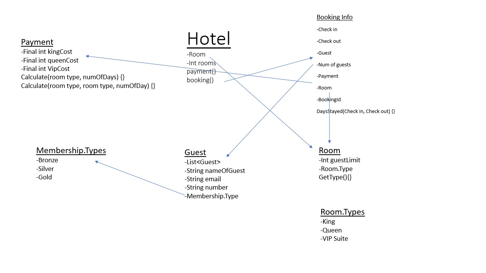
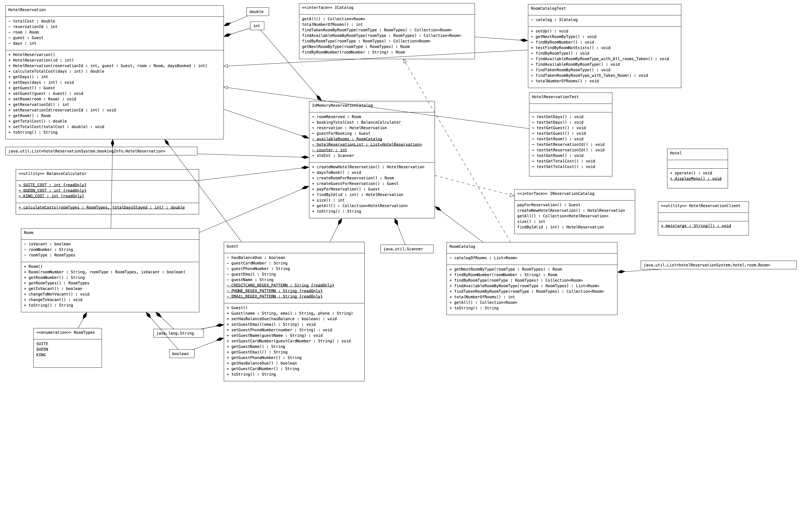

# Hotel Reservation JSS

## Project Description

Hotel reservation system 

- Room reservations
- Days to be booked 
- Cleaning fees
- Types of rooms 
- Provided food or not
- Number of guests / max per room 
- Are they a member or not / add a discount
- Check in / check out 

## Team members

- Sarthak Singh
- Joe Savella
- Shuofei Wu

## User Stories

- As a guest, I want to be able to check in with a check in and check out dates
- As a guest, I want to be able to browse hotel room types and view their details
- As a guest, I want to be able to book a hotel room
- As a guest, I want to be able to pay for my hotel room booking

